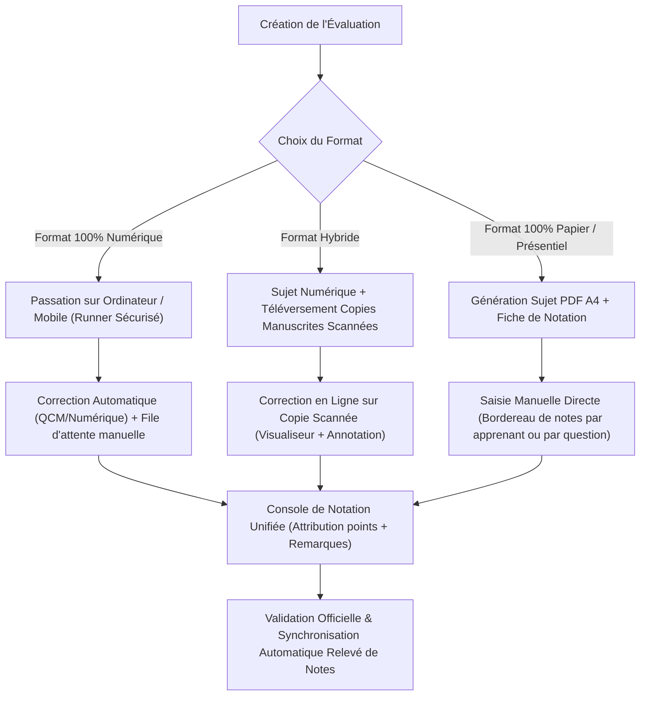

# RAPPORT D'ANALYSE GLOBALE & ROADMAP STRATÉGIQUE
## Projet Sentinelles Numériques (Plateforme Académique & Pédagogique)
**Date de l'audit :** Octobre 2026  
**Auteur de l'analyse :** Antigravity AI Engine (Google DeepMind)  
**Périmètre :** 100% du projet (Architecture, Tests, Code Source, Base de données, Sécurité, UI/UX)

---

## 1. Synthèse Exécutive & Métriques de Santé du Projet

Un audit exhaustif du code source, de la configuration de déploiement et des fonctionnalités opérationnelles a été conduit sur l'ensemble de la plateforme.

| Axe d'évaluation | Résultat constaté | Commentaire & Statut |
| :--- | :--- | :--- |
| **Suites de tests unitaires & d'intégration** | **35 / 35 fichiers réussis** (257 / 257 tests) | ✅ **100% Passants**. Deux correctifs de robustesse ont été appliqués (gestion de date dynamique dans le test de dashboard et timeout adapté sur l'import dynamique de communication). |
| **Contrôle statique des types (TypeScript)** | **0 erreur** (`tsc --noEmit`) | ✅ Code TypeScript propre et strictement conforme aux interfaces. |
| **Compilation de production (Vite / Rollup)** | **Succès complet** (`dist/` généré en 54s) | ✅ Zéro erreur de build ou de minification. |
| **Architecture de données** | Hybride (Supabase PostgreSQL + LocalStorage IDB) | 🟡 Fonctionnel avec fallback robuste, mais nécessite de finaliser la transition 100% Supabase pour éliminer la double vérité. |
| **Sécurité & Contrôle d'accès** | RBAC par route + Chiffrement + RLS + 2FA TOTP | 🟡 Robuste sur les routes principales, mais à renforcer sur la messagerie et les permissions inter-profils. |
| **Module Évaluations, Devoirs & Remises** | Riche (QCM, IA, anti-triche, exports A4) | ⚠️ **Manque le mode manuel / papier** et la notation manuelle détaillée question par question. |

---

## 2. Audit Fonctionnel Détaillé Module par Module

Ce tableau synthétise le niveau de maturité, les anomalies identifiées et les axes d'amélioration sur chaque module de la plateforme.

| Module | Fichiers clés | Rôles cibles | Statut actuel | Anomalies constatées | Actions & Améliorations recommandées |
| :--- | :--- | :--- | :--- | :--- | :--- |
| **Authentification & Sécurité** | `src/lib/auth.ts`<br>`src/contexts/AuthContext.tsx`<br>`src/pages/public/PublicPages.tsx` | Tous les rôles | 🟢 Opérationnel | Session TTL 2h gérée en client ; double gestion auth Supabase / auth locale. | Consolider la session exclusivement sur le jeton JWT Supabase avec rafraîchissement silencieux. |
| **2FA / TOTP** | `src/lib/totp.ts`<br>`src/components/TotpSettingsModal.tsx` | Superadmin, Admin, Formateur | 🟢 Opérationnel | QR code et code de récupération fonctionnels. | Forcer l'activation de la 2FA pour les profils Superadmin et Direction financière. |
| **Gestion des Apprenants** | `src/pages/admin/People.tsx`<br>`src/pages/student/StudentPages.tsx` | Superadmin, Admin, Formateur | 🟢 Opérationnel | Les groupes et classes sont parfois stockés sous forme de chaînes libres sans catalogue fermé. | Créer une table dédiée de référentiel des Groupes/Cohortes pour éviter les divergences typographiques. |
| **Gestion des Formateurs** | `src/pages/admin/People.tsx`<br>`src/pages/admin/TeacherHours.tsx` | Superadmin, Admin | 🟢 Opérationnel | Affectation des modules multivoies (tableau de chaînes + cours + planning). | Unifier l'attribution via la table relationnelle `teacher_modules` comme source de vérité exclusive. |
| **Formations, Modules & Pédagogie** | `src/pages/admin/Operations.tsx`<br>`src/lib/access.ts` | Admin, Formateur, Apprenant | 🟢 Opérationnel | Liaison souple par nom ou code nécessitant parfois des heuristiques. | Imposer l'UUID ou le code officiel unique sur chaque liaison cours-module-programme. |
| **Emploi du temps & Calendrier** | `src/pages/admin/Operations.tsx`<br>`src/pages/shared/Calendar.tsx` | Tous | 🟢 Opérationnel | Détection de conflits de salle et formateur validée. | Ajouter la synchronisation iCal/Google Calendar exportable pour les étudiants et formateurs. |
| **Présences & Scanner QR** | `src/pages/admin/Operations.tsx`<br>`src/pages/shared/QrScanner.tsx` | Admin, Formateur, Apprenant | 🟢 Opérationnel | Scanner caméra réactif avec badges QR et géolocalisation. | Ajouter un seuil d'alerte automatique (ex: 3 absences consécutives = convocation automatique scolarité). |
| **Cours & Supports de cours** | `src/pages/admin/Operations.tsx`<br>`src/pages/teacher/TeacherPages.tsx` | Formateur, Apprenant | 🟢 Opérationnel | Upload de documents et liens externes fonctionnels. | Ajouter un visualiseur PDF / lecteur vidéo directement intégré sans téléchargement obligatoire. |
| **Devoirs (Assignments)** | `src/modules/assignments/*`<br>`src/pages/shared/Submissions.tsx` | Formateur, Apprenant | 🟢 Opérationnel | Upload de devoirs avec limites de format et pénalités de retard. | Manque le correcteur visuel interactif (annotation PDF sur la copie de l'élève) et grilles critériées. |
| **Évaluations & Tests (Assessments)** | `src/modules/assessments/*`<br>`src/modules/unified-assessments/*` | Formateur, Apprenant | 🟡 Partiel | **Orienté 100% quiz en ligne**. Aucune saisie directe pour un examen papier tenu en classe. | **Ajouter le Mode Examen Manuel / Papier** et la saisie de notes question par question (voir Focus #1). |
| **Boîte de Réception des Remises** | `src/modules/unified-assessments/components/UnifiedSubmissionsInbox.tsx` | Formateur, Admin | 🟡 Partiel | La consultation d'une copie de test est en lecture seule : impossible d'ajuster les points d'une question ouverte. | Rendre les champs de points modifiables pour chaque question avec calcul instantané du total. |
| **Notes & Relevés / Bulletins** | `src/pages/admin/Operations.tsx`<br>`src/pages/admin/BulletinPage.tsx` | Admin, Formateur, Apprenant | 🟢 Opérationnel | Bulletins officiels A4 avec QR Code d'authenticité et calcul de moyennes pondérées. | Permettre l'archivage PDF signé numériquement et l'envoi direct par email aux parents/tuteurs. |
| **Finances, Paiements & Factures** | `src/pages/admin/Operations.tsx`<br>`src/pages/student/StudentPages.tsx` | Superadmin, Admin, Apprenant | 🟢 Opérationnel | Échéanciers, reçu de paiement, calcul du solde restant. | Automatiser les relances d'échéances impayées par notification push / SMS / WhatsApp via Webhook. |
| **Bourses & Certificats** | `src/pages/admin/Operations.tsx`<br>`src/pages/public/CertificateVerify.tsx` | Admin, Partenaire, Public | 🟢 Opérationnel | Génération de certificats avec URL publique de vérification. | Intégrer un QR code dynamique contenant la clé de hachage SHA-256 du diplôme. |
| **Portail Partenaire** | `src/pages/partner/*` | Partenaire, Admin Partenaire | 🟢 Opérationnel | Vue dédiée sur apprenants boursiers, présences et rapports. | Ajouter un filtrage strict pour que chaque partenaire ne voie QUE ses propres boursiers (cloisonnement). |
| **Messagerie Interne** | `src/pages/shared/Communication.tsx`<br>`src/lib/supabase/communication.ts` | Tous | ⚠️ À encadrer | Tout le monde peut écrire à tout le monde sans restriction. Risque de perturbations. | **Mettre en place une matrice de droits de communication** (voir Focus #2). |
| **Agents IA (ENIA 2.0 & Sentinel)** | `src/pages/shared/Enia.tsx`<br>`src/pages/admin/SentinelAiAdminPage.tsx` | Tous | 🟢 Opérationnel | RAG multi-format, recherche web, assistant pédagogique. | Ajouter un bouton "Expliquer la correction" directement sur les copies de devoirs corrigées. |
| **Journal d'Audit & Gouvernance** | `src/pages/admin/Dashboard.tsx`<br>`src/lib/supabase/audit.ts` | Superadmin, Admin | 🟢 Opérationnel | Historique des actions sensibles consigné. | Ajouter un export PDF/Excel certifié du registre d'audit pour les inspections académiques. |

---

## 3. Focus Stratégique #1 : Refonte du Module Évaluations, Devoirs et Remises

### 3.1. Diagnostic Critique de l'Existant
1. **Dichotomie actuelle :** 
   - Le système sépare les « Devoirs » (travaux de recherche ou projets avec remise de fichiers) et les « Évaluations » (épreuves chronométrées avec questions interactives).
   - La boîte de réception unifiée (`UnifiedSubmissionsInbox`) regroupe les deux dans une interface unique, ce qui est une excellente base.
2. **Points de blocage majeurs identifiés :**
   - **Absence de support pour les Épreuves Présentielles sur Papier :** Dans les établissements réels, de nombreux examens se déroulent sur table (amphithéâtre, salle de classe) avec stylo et feuille. Il n'existe aucun moyen de créer un sujet officiel "Examen Papier", d'imprimer les sujets, puis d'enregistrer les copies physiques.
   - **Correction des questions ouvertes incomplète :** L'évaluateur automatique marque les questions longues comme `en_attente`, mais l'écran de consultation de copie ne permet pas à l'enseignant de saisir manuellement les points attribués question par question.
   - **Absence de téléversement de compositions manuscrites :** Pour les mathématiques, l'algorithmique ou les schémas industriels, les apprenants ont souvent besoin de rédiger à la main, de scanner ou photographier leur travail et de le déposer dans l'évaluation.

---

### 3.2. Architecture Cible : Le Mode Évaluation Hybride (Numérique & Manuel)



---

### 3.3. Spécifications des Fonctionnalités à Déployer

#### A. Création et Composition Manuelle de Sujets
- **Éditeur de sujet physique / papier :**
  - Ajout d'une option `formatEpreuve: "numerique" | "papier" | "hybride"` dans `Assessment`.
  - Pour les épreuves papier : génération d'un document PDF A4 prêt pour l'impression comprenant :
    * En-tête officiel de l'établissement avec logo, filière, niveau, durée, barème.
    * Grille d'identification de l'apprenant (Nom, Prénom, Matricule, Code QR de copie unique).
    * Énoncé structuré avec emplacement pour les réponses ou instructions pour feuille intercalaire.
    * Barème visible par exercice/question.

#### B. Dépôt de Compositions Manuscrites par les Apprenants
- **Module Caméra / Scanner Mobile intégré :**
  - Dans l'espace étudiant, permettre d'ajouter une ou plusieurs photos de leurs feuilles manuscrites lors de la passation de l'épreuve.
  - Conversion automatique des images capturées en un document PDF multipages compressé et lisible.
  - Protection contre les dépassements d'horaire (horodatage serveur inviolable).

#### C. Console de Notation et Correction Manuelle Professionnelle
- **Notation Question par Question :**
  - Dans `UnifiedSubmissionsInbox.tsx`, remplacer le tableau statique de questions par une interface interactive de notation :
    * Champ numérique `Points attribués` (borné de 0 au maximum prévu pour la question).
    * Champ `Commentaire correcteur / Annotation`.
    * Bouton `Barème complet attribué` (raccourci pour attribuer la note maximale en un clic).
    * Raccourcis clavier (flèches pour passer à l'étudiant suivant, pavé numérique pour noter).
- **Grille Critériée d'Évaluation (Rubrics) :**
  - Permettre de définir des critères (ex: *Démarche d'analyse*, *Justesse du résultat*, *Clarté de la rédaction*).
  - Évaluation par échelle de niveau (Insuffisant, Moyen, Bon, Excellent) avec conversion automatique en points.
- **Feedback Vocal Enseignant :**
  - Enregistreur audio intégré de 60 à 90 secondes permettant au professeur de laisser un commentaire oral personnalisé à l'apprenant.

---

## 4. Focus Stratégique #2 : Matrice de Restrictions, Profils & Cloisonnement

### 4.1. État Actuel & Risques Constatés
Dans la version actuelle :
1. **Messagerie interne :** Un apprenant peut sélectionner n'importe quel autre apprenant de n'importe quelle promotion, ainsi que n'importe quel membre de la direction ou enseignant.
2. **Risques identifiés :**
   - Risque de démarchage ou harcèlement entre élèves.
   - Envoi de messages non académiques pendant les périodes de cours ou d'examens.
   - Perturbation des équipes de direction avec des requêtes qui relèvent normalement du formateur de la classe.
   - Absence de traçabilité des communications formateur/apprenant pour les administrateurs.

---

### 4.2. Matrice d'Autorisation des Communications Cible

| Expéditeur | Super Admin | Administration | Formateur | Apprenant (Même promotion) | Apprenant (Autre promotion) | Partenaire |
| :--- | :---: | :---: | :---: | :---: | :---: | :---: |
| **Super Admin** | ✅ Oui | ✅ Oui | ✅ Oui | ✅ Oui (Diffusion/Direct) | ✅ Oui (Diffusion/Direct) | ✅ Oui |
| **Administration** | ✅ Oui | ✅ Oui | ✅ Oui | ✅ Oui (Diffusion/Direct) | ✅ Oui (Diffusion/Direct) | ✅ Oui |
| **Formateur** | ✅ Oui | ✅ Oui | ✅ Oui | ✅ Ses apprenants uniquement | ❌ Non autorisé | ❌ Non autorisé |
| **Apprenant** | ⚠️ Support Direction | ✅ Scolarité | ✅ Ses formateurs uniquement | ⚙️ Configurable (Actif/Inactif) | ❌ Bloqué par défaut | ❌ Non autorisé |
| **Partenaire** | ✅ Oui | ✅ Oui | ❌ Non | ❌ Non (via Administration) | ❌ Non | ✅ Entre partenaires |

---

### 4.3. Règles et Mécanismes de Restriction à Déployer

1. **Option d'Administration « Politique de Communication » dans Paramètres :**
   - `allow_student_to_student_messages` : Activer ou interdire le chat direct entre élèves.
   - `limit_student_to_own_group` : Si actif, un élève ne peut converser qu'avec les camarades de sa propre classe.
   - `enable_exam_blackout` : Pendant les heures d'examen, toute la messagerie des étudiants concernés est automatiquement gelée en lecture seule.
2. **Cloisonnement Pédagogique Formateur :**
   - Un formateur ne doit voir dans son annuaire de messages QUE les étudiants inscrits aux modules qu'il dispense actuellement.
3. **Filtre Anti-Spam & Modération Automatisée :**
   - Limitation à 10 messages par heure pour les comptes étudiants pour éviter le spamming.
   - Détection automatique par IA de contenus inappropriés ou vulgaires avant validation de l'envoi.

---

## 5. Roadmap Priorisée d'Implémentation & Plan d'Action

### Phase 1 — Stabilisation & Sécurisation Immédiate (Sprint 1)
- [x] **Audit des tests et suppression des fragilités :**
  - Correction de la date dynamique dans `src/__tests__/dashboard_dynamic_data.test.ts`.
  - Sécurisation du délai d'attente async dans `src/__tests__/communication.test.ts`.
  - Résultat : **35/35 suites de tests passantes (257 tests réussis)**.
- [ ] **Mise en place de la matrice de communication stricte :**
  - Filtrage dans `fetchMessagingRecipients()` et `Communication.tsx` : les apprenants ne voient que leurs professeurs attitrés et la scolarité.
  - Interdiction par défaut du contact direct entre apprenants de classes distinctes.
- [ ] **Nettoyage CI/CD Supabase :**
  - Suppression de la référence à l'Edge Function inexistante `bootstrap-superadmin` dans `.github/workflows/supabase-deploy.yml`.

### Phase 2 — Module Évaluations : Mode Manuel & Hybride (Sprint 2)
- [ ] **Extension du modèle Assessment & Assignment :**
  - Ajout des drapeaux `formatEpreuve: "numerique" | "papier" | "hybride"`.
  - Ajout du support de pièces jointes manuscrites pour les épreuves étudiants.
- [ ] **Générateur de Sujet d'Examen Papier A4 :**
  - Création du composant d'exportation d'épreuve imprimable avec en-tête académique, cartouche apprenant et code de copie.
- [ ] **Console de Notation Manuelle Question par Question :**
  - Modification de `UnifiedSubmissionsInbox.tsx` pour permettre la saisie individuelle de points et remarques sur chaque question ouverte.
  - Calcul dynamique en direct du total sur le barème et bouton de validation définitive.
- [ ] **Bordereau de Saisie Rapide par Module :**
  - Tableau matriciel permettant à l'enseignant de saisir les notes d'une classe entière pour un examen papier en moins de 3 minutes.

### Phase 3 — Modernisation UI/UX & Expérience Apprenant (Sprint 3)
- [ ] **Interface Runner d'Évaluation Modernisée :**
  - Ajout du marquage "Question à revoir plus tard" avec pastille ambre sur le volet de navigation.
  - Vue split-screen pour les devoirs : Sujet PDF à gauche, éditeur de réponse / zone d'upload à droite.
- [ ] **Grilles d'Évaluation Critériées (Rubrics) :**
  - Intégration de critères qualitatifs de notation avec calcul pondéré automatique.
- [ ] **Commentaires Vocaux Formateur :**
  - Intégration d'un enregistreur audio web pour laisser des feedbacks audio aux élèves.

### Phase 4 — Gouvernance Avancée & Automatisation (Sprint 4)
- [ ] **Module de Restriction Planifiée :**
  - Possibilité de programmer la fermeture ou l'ouverture automatique d'un module selon un calendrier prévisionnel.
- [ ] **Relances Financières & Assiduité Automatisées :**
  - Activation des notifications push et alertes automatiques programmées via Supabase Edge Functions.
- [ ] **Transition Définitive 100% Supabase :**
  - Migration des derniers états locaux `db.*` vers les tables Supabase avec souscription Realtime native.

---

## 6. Guide de Démarrage Rapide pour Consulter et Tester

Pour exécuter et vérifier l'ensemble de la suite logicielle :

```bash
# 1. Vérification de l'intégrité TypeScript
npm run typecheck

# 2. Exécution de tous les tests unitaires et d'intégration
npm run test

# 3. Compilation de production
npm run build

# 4. Lancement du serveur de développement local
npm run dev
```

---
*Ce document sert de référence technique et fonctionnelle pour le pilotage et le déploiement des prochaines versions de Sentinelles Numériques.*
