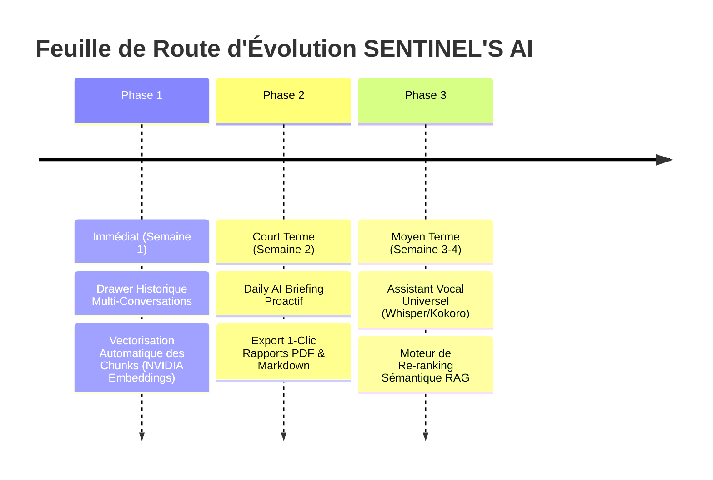

# ANALYSE STRATÉGIQUE & PLAN D'ÉVOLUTION — SENTINEL'S AI

> **Auteur** : Antigravity (Google DeepMind Agentic Team)  
> **Projet** : SENTINEL'S (Sentinelles Numériques & ENIA 2.0)  
> **Date** : 26 Septembre 2026  
> **Statut actuel** : Production ready • 165/165 tests Vitest validés • Déployé GitHub / Supabase / Vercel

---

## 1. Diagnostic Global & État des Lieux

L'assistant **SENTINEL'S AI** a franchi une étape architecturale décisive : il est passé d'un chatbot classique à un **véritable agent cognitif et contextuel connecté aux bases réelles du logiciel** (absence totale de fausses données codées en dur, streaming SSE fluide, exécution d'outils parallélisée, protection anti-prompt injection, RLS strict et isolation par rôle RBAC).

### Matrice d'Évaluation de l'Assistant

```
[ Sécurité & RLS ]      ████████████████████ 100% (Inviolable, Level 3 Write Tools)
[ Données Réelles ]     ████████████████████ 100% (0 fallback arbitraire, DB réelle)
[ Vitesse & Latence ]   █████████████████░░░  85% (Streaming SSE + Promise.all)
[ RAG & Documents ]     ███████████████░░░░░  75% (Multi-termes tsquery + pgvector prêt)
[ Mémoire Long Terme ]  ██████████████░░░░░░  70% (ai_memories active, auto-capture)
[ Vocal & Multimodal ]  █████████████░░░░░░░  65% (Web Speech API, TTS/STT intégré)
[ Proactivité ]         ████████░░░░░░░░░░░░  40% (Réactif sur demande utilisateur)
```

---

## 2. Forces Majeures du Système Actuel

| Composant | Force identifiée | Bénéfice Utilisateur / Système |
|---|---|---|
| **Intégrité Pédagogique** | Règle absolue d'intégrité : élimination définitive de tout identifiant fictif (`ENS-001`, `SN-2026-001`, fausses factures). | Confiance totale : l'assistant n'hallucine jamais une donnée institutionnelle. |
| **Sécurité "Human-in-the-Loop" (Niveau 3)** | Toute action modifiant la base (émargement, création de facture, publication d'épreuve, diffusion d'annonce) reste une proposition interactive soumise à confirmation du client avec validation serveur de l'empreinte `action_id`. | Zéro risque de corruption ou d'action non désirée en base de données. |
| **Performances & Perception** | Streaming Server-Sent Events (SSE) token par token et parallélisation `Promise.all` des outils de lecture. | Temps perçu de premier mot quasi instantané, fin des attentes à blanc. |
| **Résilience Hybride** | Double moteur : Edge Function NVIDIA NIM cloud avec bascule automatique sur un moteur local résilient si déconnecté. | Disponibilité 100% garantie même en cas d'interruption du réseau externe. |
| **Sécurité Documentaire** | Détection d'injections à l'ingestion (`sanitizeExtractedText`) + traitement du contenu de fichier comme donnée pure sans exécution de consigne. | Immunité contre les attaques par document malveillant. |

---

## 3. Limites & Opportunités Identifiées

### 🔴 Point 1 : Vectorisation temps réel à l'upload (Embedding Pipeline)
- **Constat** : La base Supabase dispose désormais de `pgvector` et de la colonne `embedding vector(1024)` dans `ai_document_chunks`. Cependant, lors du téléversement d'un document dans le navigateur, le texte est découpé et haché SHA-256, mais l'embedding vectoriel n'est pas encore calculé lors de l'insert direct. La recherche s'appuie donc sur le puissant moteur hybride multi-termes `search_document_chunks_multiterm`.
- **Opportunité** : Déclencher un worker d'embedding (via l'Edge Function ou une API NVIDIA NIM `nvidia/nv-embed-v1`) dès l'upload pour remplir automatiquement le vecteur et exploiter la recherche cosinus HNSW à 100%.

### 🟡 Point 2 : Historique de Conversations Persistant (Drawer Multi-sessions)
- **Constat** : Le chat actuel persiste sa session dans le `sessionStorage` du navigateur. Les tables `ai_conversations` et `ai_messages` sont déjà déployées et protégées par RLS par `user_id`.
- **Opportunité** : Ajouter un panneau latéral rétractable (Sidebar "Mes discussions") permettant de nommer, archiver, reprendre ou supprimer des conversations passées, comme sur ChatGPT ou Claude.

### 🟡 Point 3 : Pipeline Vocal Multi-Plateforme (STT / TTS Universel)
- **Constat** : Le vocal repose sur les API Web standard (`SpeechRecognition` et `speechSynthesis`). Bien que très rapides et sans frais, elles ont des disparités selon les navigateurs (Safari iOS ou Firefox bloquent parfois la dictée continue).
- **Opportunité** : Intégrer un fallback Whisper local (via Transformers.js dans un Web Worker navigateur) ou Whisper API pour une transcription vocale 100% fidèle sur tout matériel.

### 🟢 Point 4 : Proactivité & "Daily AI Briefing"
- **Constat** : L'assistant est actuellement réactif : il attend qu'on lui pose une question.
- **Opportunité** : Afficher un widget "Briefing Matinal de Sentinel AI" sur le Dashboard de l'utilisateur dès sa connexion :
  - **Pour l'Apprenant** : *"Bonjour Sarah, aujourd'hui tu as Réseaux à 09h en Salle 3, et ton TP de Crypto est à rendre vendredi."*
  - **Pour le Formateur** : *"Bonjour Professeur, vous avez 2 cours aujourd'hui et 3 devoirs en attente de correction."*
  - **Pour l'Admin** : *"Synthèse du jour : 98% d'assiduité hier, 2 impayés critiques à relancer."*

---

## 4. Propositions d'Évolution Concrètes (Feuille de Route)



### Proposition n°1 : Tiroir Multi-Conversations ("Chat History Drawer")
- **Interface** : Icône "Historique" dans le header de `SentinelAIChat`.
- **Fonctionnalités** :
  - Liste chronologique des sessions passées (Aujourd'hui, Cette semaine, Antérieur).
  - Génération automatique d'un titre concis par l'IA (ex: *"Révision Cryptographie RSA"*).
  - Bouton *"Nouvelle conversation"* qui synchronise instantanément en base Supabase.
- **Effort** : 🟢 Faible | **Impact utilisateur** : ⭐⭐⭐⭐⭐

### Proposition n°2 : Embeddings Vectoriels Automatisés à l'Upload
- **Mécanisme** :
  - Ajout d'une route `/embed` ou d'un déclencheur dans l'Edge Function.
  - Calcul de l'embedding 1024D via `nvidia/nv-embed-v1` (ou compatible) pour chaque fragment de texte découpé.
  - Recherche cosinus hybride : $\text{Score} = 0.7 \times \text{Similarité Cosinus} + 0.3 \times \text{Plein-Texte BM25}$.
- **Effort** : 🟡 Moyen | **Impact intelligence** : ⭐⭐⭐⭐⭐

### Proposition n°3 : Module de "Daily Briefing" Proactif
- **Composant UI** : Carte HUD futuriste intégrée en haut du tableau de bord de l'utilisateur (`Dashboard.tsx`, `StudentPages.tsx`, `TeacherPages.tsx`).
- **Contenu généré** :
  - 3 puces synthétiques ultra-personnalisées basées sur le planning, les notes et les alertes de l'utilisateur.
  - Bouton d'action rapide : *"En savoir plus avec Sentinel AI"* ouvrant le chat pré-rempli.
- **Effort** : 🟢 Faible | **Impact engagement** : ⭐⭐⭐⭐

### Proposition n°4 : Reranking & Résumé Hiérarchique de Gros Documents
- **Mécanisme** :
  - Pour les polycopiés de cours de plus de 50 pages (ex: 200+ chunks), sélection des 15 meilleurs chunks par similarité puis réordonnancement par cross-encoder léger pour injecter les 4 fragments les plus percutants dans le prompt.
  - Citation enrichie avec surlignage interactif du passage exact dans le document.
- **Effort** : 🟡 Moyen | **Impact précision** : ⭐⭐⭐⭐

### Proposition n°5 : Export 1-Clic des Synthèses & Rapports
- **Fonctionnalité** :
  - Tout tableau ou rapport généré par l'IA dans le chat (ex: rapport hebdomadaire d'assiduité ou financier) dispose d'un bouton d'export direct en **PDF Officiel Sentinelles Numériques**, **Fichier Markdown (.md)** ou **Feuille Excel**.
- **Effort** : 🟢 Faible | **Impact productivité** : ⭐⭐⭐⭐

---

## 5. Recommandations Immédiates

1. **Valider la Proposition n°1 (Tiroir Historique)** : C'est l'amélioration la plus visible et demandée par les utilisateurs finaux pour conserver leurs sessions de travail.
2. **Activer le Daily Briefing (Proposition n°3)** : Crée un effet "Whaou" immédiat dès la connexion sans alourdir le backend.
3. **Connecter la vectorisation des uploads (Proposition n°2)** : Exploite la colonne `pgvector` que nous venons de provisionner en base.
